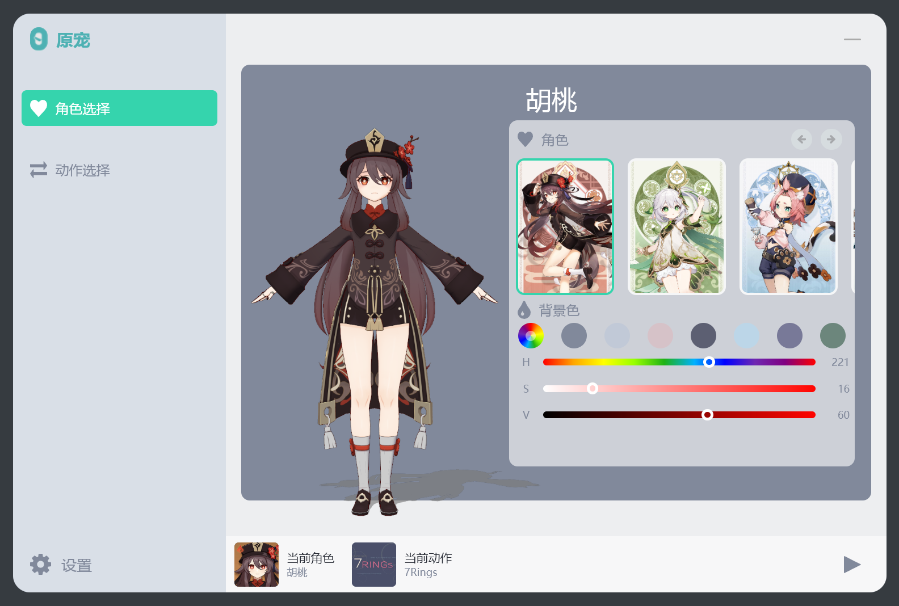
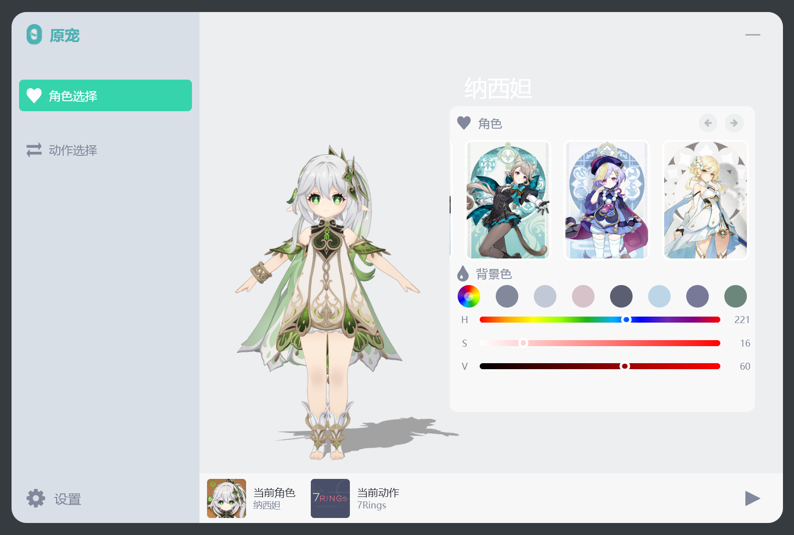
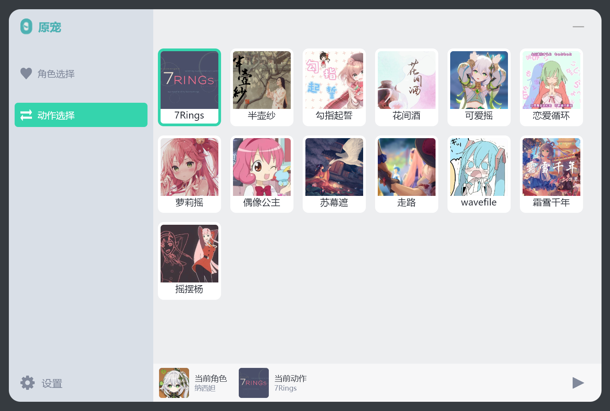
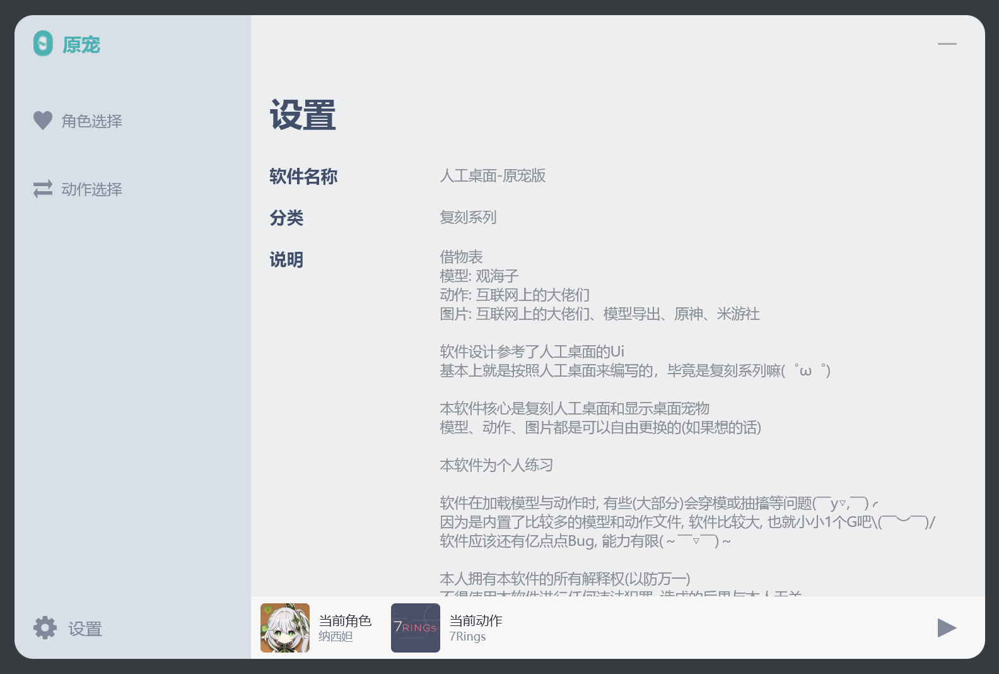
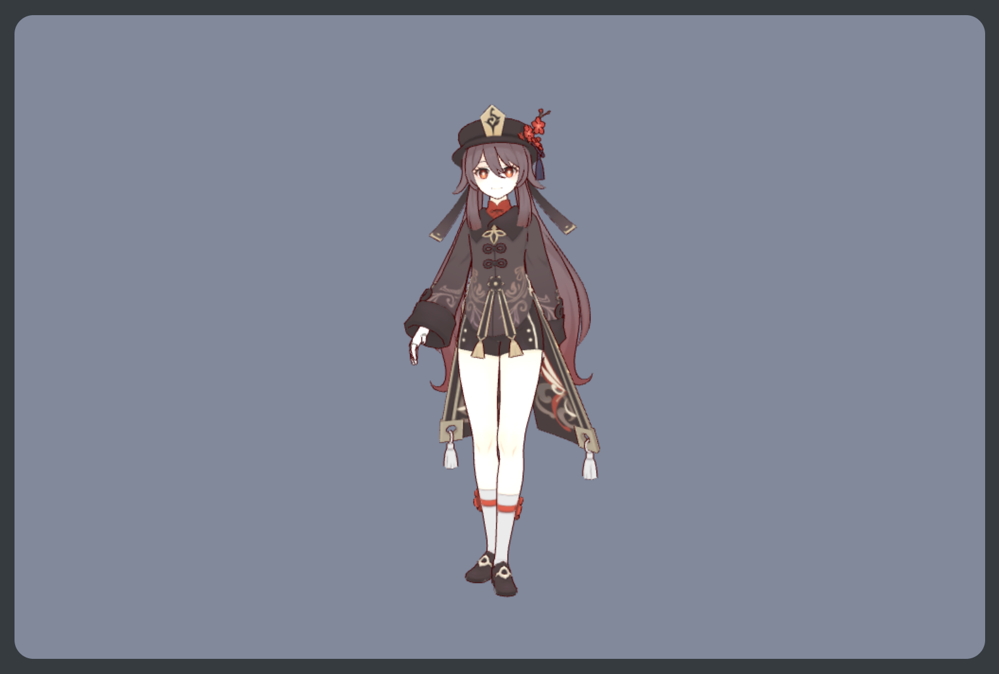
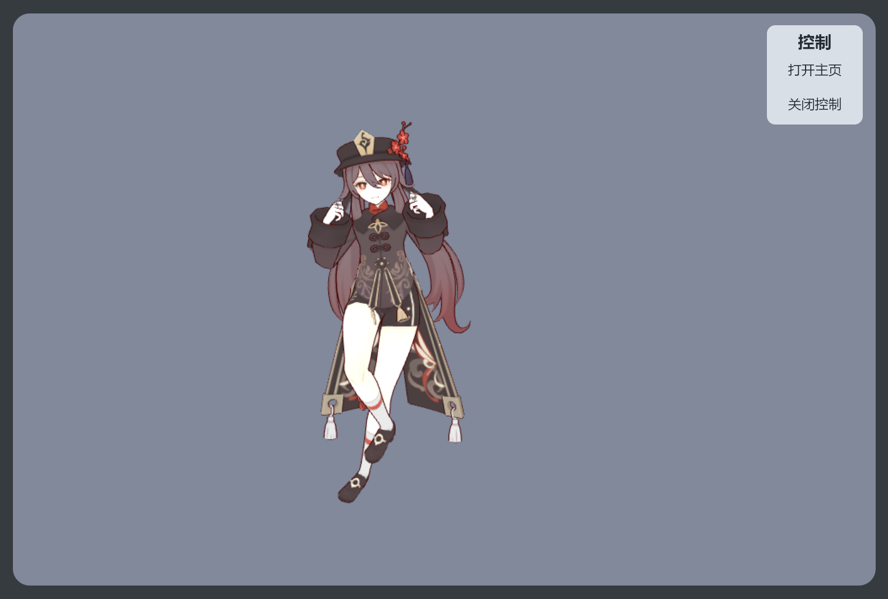
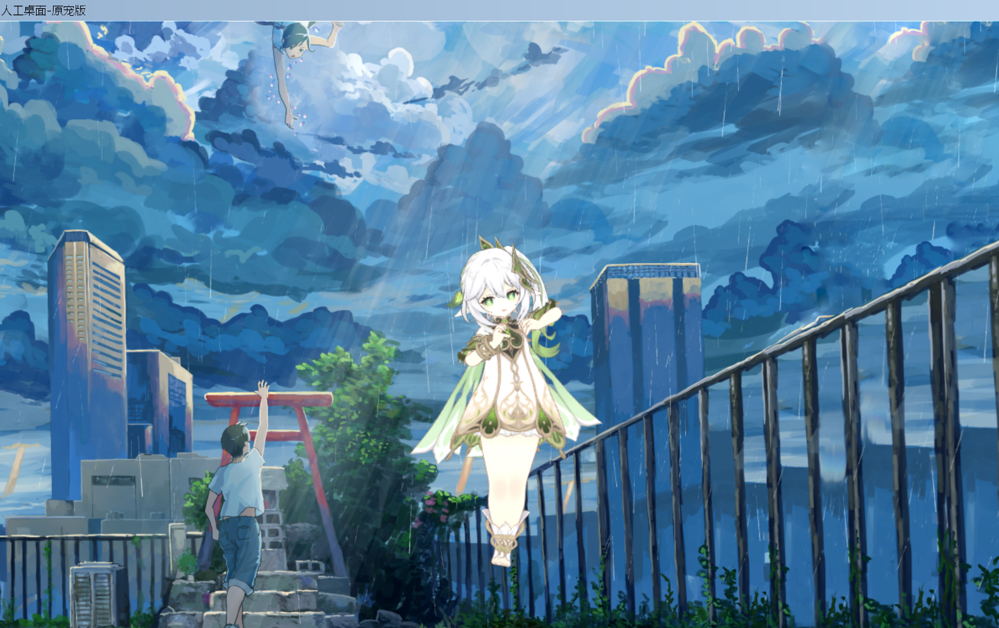

# 复刻人工桌面-原宠版

## 1. 基本信息

- 作者: GMCY
- 系列: 复刻系列
- 仓库: [GitHub](https://github.com/GMCY2020/Reprint-N0vaDesktop-Pet) | [Gitee](https://gitee.com/GMCY2020/Reprint-N0vaDesktop-Pet)
- 话题(GitHub): [vue](https://github.com/topics/vue) \ [reprint](https://github.com/topics/reprint) \ [mihoyo](https://github.com/topics/mihoyo) \ [N0vaDesktop](https://github.com/topics/N0vaDesktop) \ [desktopPet](https://github.com/topics/desktopPet) 
- 创建时间: 2023/10/27

## 2. 介绍

- 模型: 观海子
- 动作: 互联网上的大佬们
- 图片: 互联网上的大佬们、模型导出、原神、米游社

- 软件设计参考了 [人工桌面](https://n0va.mihoyo.com/#/) 的Ui
- 基本上就是按照 [人工桌面](https://n0va.mihoyo.com/#/) 来编写的，毕竟是复刻系列嘛(゜ω゜)

- 本软件核心是 `复刻人工桌面` 和 `显示桌面宠物`
- 模型、动作、图片都是可以自由更换的(如果想的话)

- 本软件为个人练习

- 软件在加载模型与动作时, 有些(大部分)会穿模或抽搐等问题(￣y▽,￣)╭
- 因为是内置了比较多的模型和动作文件, 软件比较大, 也就小小1个G吧\(￣︶￣)/ `(打包时忘记忽略依赖了, 目前300MB左右)`
- 软件应该还有亿点点Bug, 能力有限(～￣▽￣)～ 

- 本人拥有本软件的所有解释权(以防万一)
- 不得使用本软件进行任何违法犯罪, 造成的后果与本人无关
- 应该不至于吧（⊙ｏ⊙)

## 3. 环境

编辑器

- `HBuilderX`

框架

- `vue`

## 4. 使用

- 解压 `N0vaDesktop-Pet-1.0.0.zip`
- 运行 `N0vaDesktop-Pet-1.0.0/N0vaDesktop.exe` 即可

## 5. 效果图

角色选择

动作选择

设置

模型展示

透明效果

Bug
